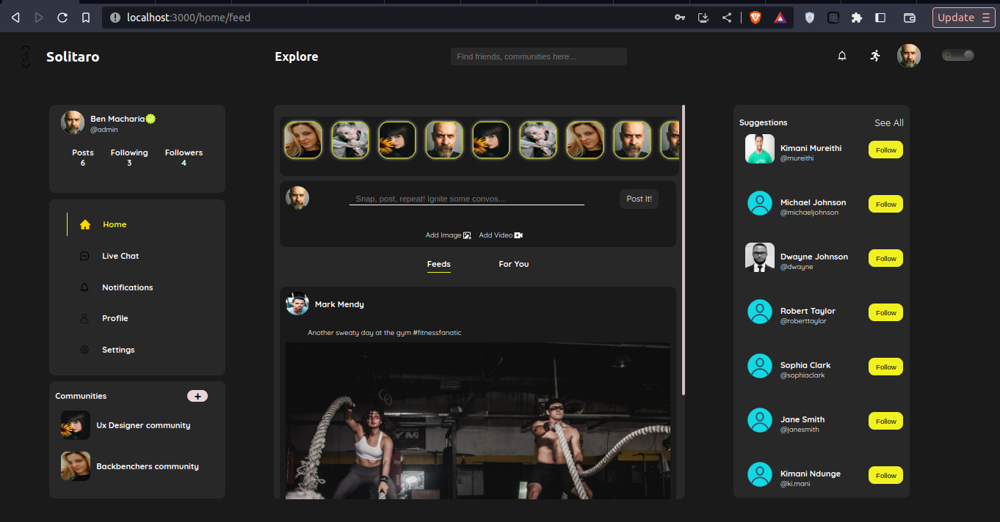

# Solitaro

**Solitaro** is a _captivating and innovative_ social media application that I developed with the aim of connecting people from all walks of life through shared interests and unique experiences. The name "SOlitaro" is derived from the words "solitary" and "tarot," symbolizing the application's core philosophy of fostering individual connections and predicting meaningful connections among its users.

## Getting Started

## Table of contents

- [Overview](#overview)
  - [The challenge](#the-challenge)
  - [Screenshot](#screenshot)
  - [Links](#links)
- [My process](#my-process)
  - [Built with](#built-with)
  - [What I learned](#what-i-learned)
  - [Continued development](#continued-development)
- [Author](#author)

## Overview

### The challenge

Users should be able to:

- Login and register hassle-free and get a notification email.
- Create a Post
- Delete a Post, Comment and Reply that they have made.
- Write a comment and reply to a comment.
- View all posts on the homepage in chronological order and also have an option of veiwing posts for people they are following
- Follow and unfollow users.
- Logout of their account.
- Verify their account and get a badge.
- See thei profile and other users profile.
- Search for users using their username
- See their notifications
- Live Chat

and much more...

### Screenshot

Landing Page

Login / Register Pages

Home Page(Light mode)

Home Page(Dark mode)

Live Chat Page

Profile Page

### Links

- Live Site URL: [Solitaro]()

### Built with

- CSS custom properties
- Node.js(Environment) and Express framework(Backend)
- Svgator(Svg Animation Tool)
- Desktop-first workflow
- [React](https://reactjs.org/) - JS library
- [CSS File](https://styled-components.com/) - For styles

### What I learned

Over the course of this project I was able to carry some things with me. I learned how to create effective APIs, how to animate SVGs using svggator tool, how to authorize users using sessions as well as retrieving and sending data to my database from the frontend and creating a user empathetic design.

### Continued development

1. Implement stories functionality.
2. Implement live chat that has video functionality.

## Author

- Website - [Portfolio(new version coming soon!)](https://academiccmacharia.github.io/ePortfoliov1/)
- Frontend Mentor - [Ben Macharia](https://www.frontendmentor.io/profile/AcademiccMacharia)
- LinkedIn - [Ben Macharia](https://www.linkedin.com/in/ben-macharia/)
